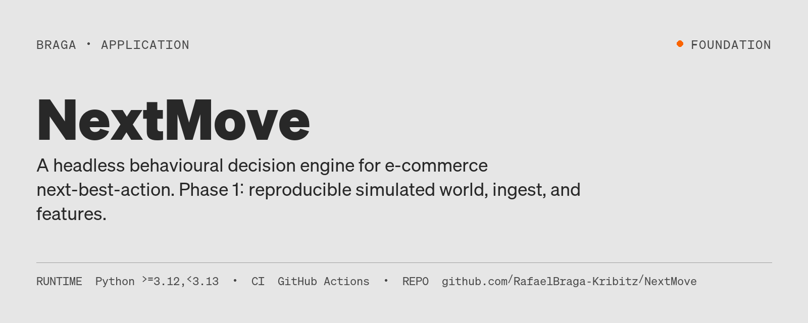
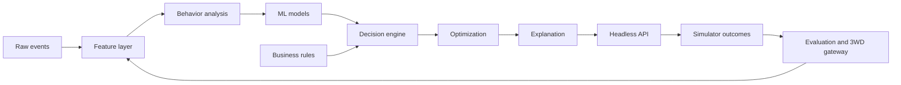

# NextMove



[](https://github.com/RafaelBraga-Kribitz/NextMove/actions/workflows/ci.yml)
[](https://www.python.org/downloads/release/python-3120/)
[](#status)
[](LICENSE)

**Status:** Foundation

E-commerce teams get scores, segments, and journeys — not a next action they can defend to finance. NextMove is a headless behavioral decision engine that turns customer events and business constraints into an explainable next-best-action, including the action of doing nothing.



## Project status

Phase 1 is a **reproducible simulated e-commerce world** plus the locked architecture, ADRs, and package boundaries. The decision API, trained models, and manager-facing demo are specified, not shipped.

**Exists today:** simulator → ingest → point-in-time features, seeded and runnable on a laptop (`just reproduce`). Foundation documents and ten ADRs under [`docs/`](docs/README.md).

**Does not exist yet:** production results, a live demo, or a quantitative policy comparison. No results are quoted here because none have been published. Decision evaluation in this project is in simulation only (ADR-004).

## See it running

There is no interactive UI in this phase. The runnable surface is the CLI pipeline:

```bash
uv sync
just simulate profile="tiny"
just ingest profile="tiny"
just features profile="tiny"
```

CI reproduces the same quality gate: `just ci` (ruff, import-linter, pytest). See [`.github/workflows/ci.yml`](.github/workflows/ci.yml).

## Explore this project

| Audience | Start here |
|---|---|
| Recruiter | This page — problem, [Status](#status), [Architecture](#architecture) |
| Hiring manager | [`docs/PROJECT_IDENTITY.md`](docs/PROJECT_IDENTITY.md) + [`docs/PRODUCT_CHARTER.md`](docs/PRODUCT_CHARTER.md) |
| Technical reviewer | [`docs/ARCHITECTURAL_DIRECTION.md`](docs/ARCHITECTURAL_DIRECTION.md) + `src/nextmove/` |
| Auditor | [`docs/SIMULATOR_ASSUMPTIONS.md`](docs/SIMULATOR_ASSUMPTIONS.md) + [`docs/QUALITY_BAR.md`](docs/QUALITY_BAR.md) + ADRs |

Fast path: this README. Deep path: the foundation set indexed in [`docs/README.md`](docs/README.md).

## The idea

Recommendation engines answer "which item?". NextMove answers "what should we do next for this customer — including wait or offer nothing — under inventory, margin, and fatigue constraints, with a reason a marketing manager can read."

Every change to the system is specified to survive a three-way (accept / reject / delay) experimentation gateway before it ships. No LLM is in the decision or explanation path ([`docs/QUALITY_BAR.md`](docs/QUALITY_BAR.md)).

## Method

```text
Simulator events
  → ingest / schema validation
  → point-in-time features
  → (later) models + rules + decision engine
  → explanation
  → 3WD evaluation gateway
```

Phase 1 implements the first three stages. Later stages are specified in [`docs/DECISION_ENGINE_DESIGN.md`](docs/DECISION_ENGINE_DESIGN.md) and the ADRs; they are not claimed as implemented.

## Data

| Tag | Meaning | Applies to |
|---|---|---|
| `SIMULATED` | Generated by the seeded world in `src/nextmove/simulator` | Events, catalog, ground truth |
| `ILLUSTRATIVE` | Design-time examples in docs | Charter personas, target metrics marked "X reported, not invented" |

No client e-commerce data is in this repository. Assumption log: [`docs/SIMULATOR_ASSUMPTIONS.md`](docs/SIMULATOR_ASSUMPTIONS.md).

## Architecture

Nine load-bearing components (ML is one of them), from [`docs/ARCHITECTURAL_DIRECTION.md`](docs/ARCHITECTURAL_DIRECTION.md):

1. Event ingestion and telemetry
2. Feature layer
3. Behavior analysis / segmentation
4. ML models
5. Decision engine
6. Business rules
7. Optimization layer
8. Explanation engine
9. Evaluation and 3WD gateway

Package map (what is on disk under `src/nextmove/`):

```text
src/nextmove/
  simulator/   ingest/   features/   storage/   config/
  models/      segmentation/   rules/   decisions/
  policies/    explain/   evaluate/   api/
```

## Reproduce

Python 3.12, [`uv`](https://docs.astral.sh/uv/), [`just`](https://github.com/casey/just).

```bash
git clone https://github.com/RafaelBraga-Kribitz/NextMove.git
cd NextMove
uv sync
just ci
just reproduce profile="tiny"
```

`just reproduce` runs the DVC DAG `simulate → ingest → features`. Expected artifacts: tables under `data/` (generated, not committed as the source of truth — lineage is in DVC).

## Limitations

- Decision quality is **not** established. There is no published policy-comparison table yet.
- All future decision metrics from this repo are **in simulation** unless a later ADR says otherwise.
- The simulator is the primary data source and the primary credibility risk; readers who skip [`docs/SIMULATOR_ASSUMPTIONS.md`](docs/SIMULATOR_ASSUMPTIONS.md) cannot tell signal from world-building artifact.
- Reconsider any production-readiness claim if a client dataset has not been swapped in, or if a random (non-temporal) split appears in evaluation.

## Repository structure

| Path | Responsibility |
|---|---|
| `src/nextmove/` | Product packages (simulator through API) |
| `tests/` | Unit, integration, leakage, golden |
| `config/` | Schema-validated configuration |
| `docs/` | Foundation documents and ADRs (SSOT) |
| `dvc.yaml` / `dvc.lock` | Pipeline and artifact lineage |

## Status

**Status:** Foundation

GitHub description: reproducible simulated e-commerce world (Phase 1). Last validated against the in-repo foundation set on 2026-09-16.

## License

Apache-2.0. See [`LICENSE`](LICENSE).

## Author

<table>
  <tr>
    <td width="110">
      
    </td>
    <td>
      <strong>Rafael Braga-Kribitz</strong><br />
      Seiersberg-Pirka, Austria · Portfolio project, 2026<br />
      <a href="https://www.linkedin.com/in/rafaelbragakribitz/">LinkedIn</a>
      ·
      <a href="mailto:rafaelbragakribitz@gmail.com">rafaelbragakribitz@gmail.com</a>
    </td>
  </tr>
</table>
